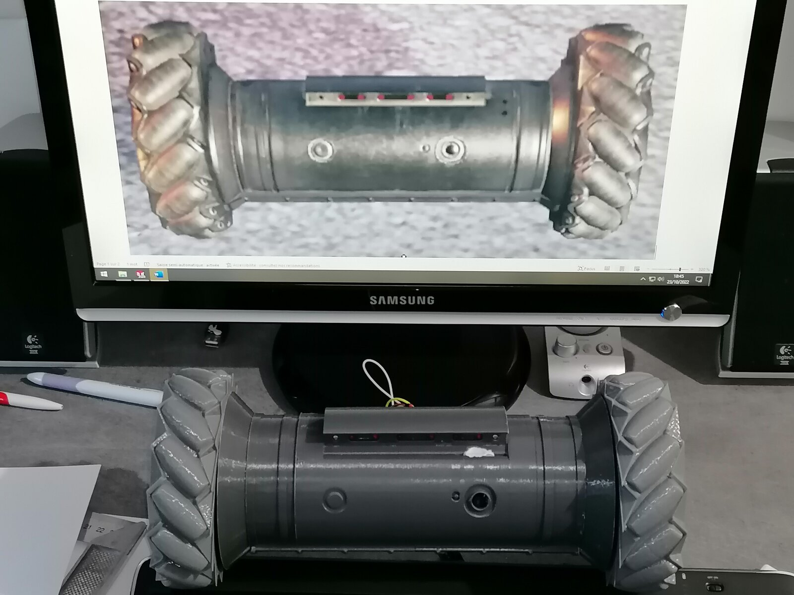
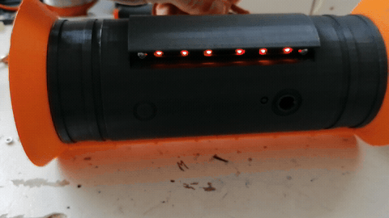
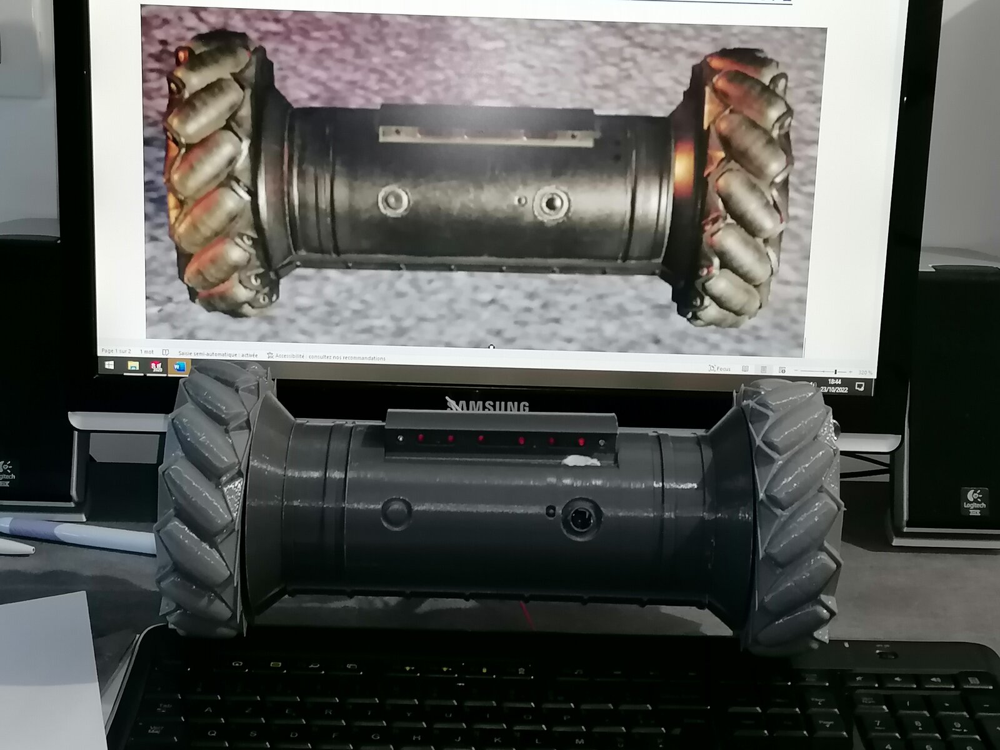
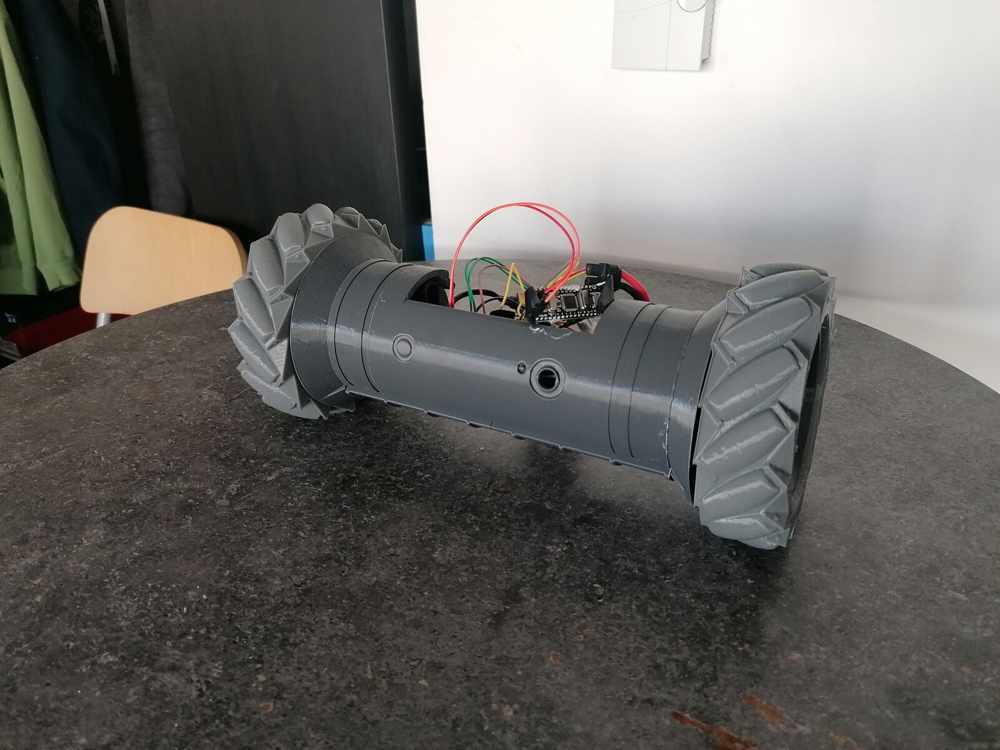

# Recon Ground Drone

*Langue : **Français** · [English](README.md)*

Un petit drone terrestre RC imprimé en 3D, inspiré du drone de reco au sol de
*Rainbow Six Siege*. C'est un projet perso que je traîne depuis 2022, et je me suis
enfin décidé à publier les fichiers pour que d'autres puissent s'en servir, le
bidouiller, et (j'espère) le faire avancer plus loin que moi.

Pour piloter : un ESP32-CAM, une page web avec un joystick virtuel, et le retour
vidéo de la caméra directement dans le navigateur. Les premières versions tournaient
sur d'autres montages (voir l'histoire juste en dessous), que j'ai laissées dans le
repo pour l'historique.

> Projet de fan, **non officiel**. « Rainbow Six » et le design du drone sont à Ubisoft.
> Je ne suis affilié à personne, c'est non commercial, et les modèles 3D sont mes
> propres créations inspirées du jeu.

## Démo

<p align="center">
  
  <br><em>Le drone imprimé à côté de son rendu SolidWorks d'origine.</em>
</p>

<p align="center">
  
  <br><em>Oui, ça roule pour de vrai. Clip complet : <a href="media/demo-drive.mp4"><code>media/demo-drive.mp4</code></a></em>
</p>

## Un peu d'histoire

À la base, ce drone était un cadeau d'anniversaire pour un ami. Sa version à lui
tournait sur Arduino, avec un retour FPV analogique et un récepteur PWM Flysky :
donc un pilotage à la radio, avec lunettes/écran FPV. Cette version-là n'est pas
dans ce repo, mais c'est le vrai point de départ du projet.

Ensuite, pour mon propre usage, je voulais quelque chose de plus confortable : tout
piloter depuis un seul appareil, sans avoir à trimballer un masque ou un écran FPV
en plus du smartphone. De là est née une version WiFi pilotable depuis le téléphone
(la base Arduino + ESP8266 que vous trouverez dans `firmware/arduino-esp8266-legacy`).

Puis j'ai découvert l'ESP32-CAM, qui embarque directement la caméra. Je me doutais
que la latence serait plus élevée — et effectivement elle l'est — mais avoir tout
dans un seul petit module valait le coup d'essayer. C'est cette lignée ESP32-CAM qui
constitue les versions actuelles du projet.

## État actuel : honnêtement, c'est pas fini

Ce qui marche aujourd'hui, c'est le firmware **ESP32-CAM v2** avec la vidéo par WiFi.
Mais il reste deux vrais défauts que je n'ai pas résolus :

- **Ça bascule au freinage.** Quand on freine sec, le drone part en avant par inertie
  et pique du nez. C'est un problème de centre de gravité / répartition des masses.
  C'est justement ce que je voulais corriger avec la CAO V2.0… que je n'ai jamais
  terminée.
- **La portée WiFi est ridicule.** Ça fonctionne, la vidéo a juste un poil de latence,
  mais dès qu'on s'éloigne un peu ça décroche. C'est la limite du WiFi de l'ESP32-CAM.
  Au départ je voulais une vraie liaison radio FPV, je ne suis pas allé au bout.

Donc si vous cherchez par où contribuer : **l'équilibre et la portée**, c'est là que
ça coince. Les fork et les PR sont les bienvenus.

## Ce que j'aimerais voir

Soyons honnête : une des raisons pour lesquelles je publie, c'est la curiosité —
**j'aimerais voir ce que les gens sont capables d'en faire.** À ce jour je n'ai vu
aucun projet équivalent aussi abouti autour du drone de reconnaissance de R6, alors
que techniquement… ce n'est pas si compliqué.

Donc : reprenez-le, forkez-le, ou refaites carrément le vôtre dans votre coin, comme
vous voulez. Mais si vous le faites, **partagez-moi le résultat** (une issue, une PR,
ou un message). J'aimerais vraiment pouvoir voir — et tester — vos évolutions, vos
versions et vos améliorations.

## Fonctionnalités

Ce qui est déjà en place dans le firmware (versions ESP32-CAM, sauf mention contraire) :

- **Pilotage différentiel** des deux moteurs depuis un joystick virtuel : la position
  du joystick est convertie en vitesse + angle, puis répartie entre moteur gauche et
  moteur droit (rotation sur place comprise).
- **Rampe d'accélération et PWM minimum** : une limite d'accélération adoucit les
  à-coups, et un seuil de PWM minimum permet de vaincre l'inertie de démarrage des
  moteurs (réglables via `ACC_MAX` et `PWM_MIN`).
- **Retour vidéo en direct** depuis l'ESP32-CAM (capteur OV2640), affiché dans la page web.
- **Animation de LED fidèle au jeu** : un effet de balayage / « chenillard » sur les
  anneaux lumineux, façon drone de reco de R6 (allumage séquentiel extérieur → milieu
  → intérieur puis retour). Sur ESP32 : 3 groupes (`LED_OUT` / `LED_MID` / `LED_IN`) ;
  sur la version Arduino : 6 LED en balayage symétrique.
- **Déploiement motorisé des LED (comme dans le jeu)** : les feux se **déploient** via
  un **servo-moteur**, façon drone de reco qui « ouvre » ses lumières. Ça, ça marche.
  Le servo est géré dans le code (`Servo` / `servo_ctrl`).
- **Mode point d'accès (AP) ou station (STA)** au choix, via `#define AP_MODE`.
- **Gestion du flash embarqué** de l'ESP32-CAM.
- Sur la **version Arduino (legacy)** en plus : commandes directionnelles ZQSD,
  **arrêt de sécurité** automatique si aucune commande pendant 5 s, et mesure de
  tension batterie.

<p align="center">
  
  <br><em>L'effet de LED « chenillard » fidèle au jeu. Clip complet : <a href="media/leds.mp4"><code>media/leds.mp4</code></a></em>
</p>

## L'historique des versions

J'ai gardé les différentes étapes plutôt que de tout écraser, ça peut servir.

**Mécanique (CAO) —** les fichiers 3D sont disponibles en téléchargement dans la
[dernière release](https://github.com/SyrNitram/recon-ground-drone/releases/latest) (`cad.zip`).

- **V1.0** — la première version complète. Conçue entre mai et octobre 2022, c'est
  celle avec laquelle tout a commencé.
- **V1.9** — une version intermédiaire, plein de petits ajustements par-dessus la V1.0.
- **V2.0** — le redesign censé régler la bascule. J'ai bossé dessus jusqu'au 5 mars 2023
  puis je me suis arrêté. **Elle est inachevée**, à prendre comme un point de départ.

**Firmware —**

- `firmware/esp32cam-v2` — la version actuelle, celle qui marche (ESP32-CAM, vidéo WiFi,
  joystick web). Commencez par là.
- `firmware/esp32cam-v1-proto` — le prototype ESP32-CAM d'avant, gardé pour référence.
- `firmware/arduino-esp8266-legacy` — la toute première base, sur Arduino + ESP8266 en
  commandes AT (2022). C'est de l'historique, je ne le maintiens plus.

**Interface web —**

- `webui/R6DC-V1` — l'interface de pilotage principale (joystick + flux vidéo).
- `webui/joystick-tests` — mes essais de joystick virtuel en HTML, en vrac. C'est du
  brouillon, mais ça montre la démarche.

## Les fichiers 3D (CAO)

> 📦 **Télécharger les fichiers 3D :** ils sont attachés à la
> [dernière release](https://github.com/SyrNitram/recon-ground-drone/releases/latest)
> sous forme de `cad.zip` (trop lourds pour la liste principale des fichiers).

Quelques avertissements honnêtes avant d'imprimer :

- **C'est conçu à l'époque pré-Bambu Lab.** Ma machine d'alors avait une précision et
  un débit assez médiocres. Du coup **les tolérances des pièces ont été calées pour
  MA machine** — et encore, parfois tout juste. C'est aussi pour ça qu'il y a autant
  de **fichiers de test** : c'était pour ajuster ces tolérances.
- **À revoir avec les imprimantes actuelles.** Sur une machine récente (Bambu Lab et
  compagnie), les tolérances sont quasi sûrement à reprendre.
- **Format SolidWorks.** Les modèles sont en SolidWorks (`.SLDPRT` / `.SLDASM`). Si
  vous le pouvez, l'idéal serait d'adopter une **convention simple** : garder les
  fichiers natifs, mais aussi exporter des formats neutres (`STEP` pour l'édition,
  `STL` ou `3MF` prêts à imprimer), avec un dossier par version. Ça rend le tout
  réutilisable même sans SolidWorks.
- **La dernière version 3D (V2.0) n'est pas terminée.** Si vous la reprenez,
  **regardez d'abord l'assemblage virtuel complet** dans le logiciel de CAO pour
  vérifier que tout coïncide *avant* de lancer une impression — ça évite de gâcher
  du filament sur des pièces qui ne s'assemblent pas encore.

## Ce qu'il y a dans le repo

```
firmware/      le code des cartes (voir versions ci-dessus)
test-sketches/ croquis de test isolés (caméra, moteurs)
webui/         les interfaces web de pilotage
(CAO)          modèles 3D — à télécharger dans Releases → cad.zip (SolidWorks)
hardware/      la BOM (nomenclature) et quelques docs de référence
images/        photos et GIF utilisés dans ce README
media/         vidéos de démo (pilotage, LED, assemblage)
```

## Matériel

La liste complète est dans `hardware/BOM.xlsx`. En gros : un ESP32-CAM, un driver
moteur, des moteurs DC, une batterie, et les pièces imprimées. Comptez dans les
120 € de composants.

## Câblage & schéma électrique

Je n'ai pas (encore) de schéma électrique propre — **si quelqu'un veut en dessiner
un, c'est très bienvenu.** En attendant, voici le brochage **extrait directement du
code**, pour les parties reliées aux cartes programmables. La référence est
l'ESP32-CAM v2 (la version qui fonctionne).

### ESP32-CAM v2 (version actuelle)

Particularité : les sorties de **direction moteur** et les **LED** passent par un
**expandeur d'E/S I²C PCF8574** (adresse `0x20`), pour économiser les GPIO de
l'ESP32-CAM. Seules les sorties **PWM de vitesse** sont câblées directement sur l'ESP32.

Bus I²C vers le PCF8574 :

| Signal | GPIO ESP32-CAM |
|--------|----------------|
| SDA | GPIO13 |
| SCL | GPIO15 |
| Fréquence | 100 kHz |

Sorties via le PCF8574 (broches P0–P7) :

| Broche PCF8574 | Rôle |
|----------------|------|
| P0 | Moteur — IN1 (direction) |
| P1 | Moteur — IN2 (direction) |
| P2 | Moteur — IN3 (direction) |
| P3 | Moteur — IN4 (direction) |
| P5 | LED anneau extérieur |
| P6 | LED anneau milieu |
| P7 | LED anneau intérieur |

PWM de vitesse moteur (directement sur l'ESP32, via LEDC, 40 kHz / 10 bits) :

| Signal | GPIO | Canal LEDC |
|--------|------|------------|
| Moteur gauche (EN) | GPIO14 | 10 |
| Moteur droit (EN) | GPIO12 | 11 |

ESP32-CAM embarqué :

| Fonction | GPIO |
|----------|------|
| Flash LED | GPIO4 |
| LED rouge embarquée | GPIO33 |
| Caméra OV2640 | brochage standard AI-Thinker (XCLK 0, SIOD 26, SIOC 27, VSYNC 25, HREF 23, PCLK 22, D0–D7 = 5/18/19/21/36/39/34/35, PWDN 32) |

Réseau : serveur **WebSocket sur le port 82** (commandes + flux) et **serveur HTTP
sur le port 80** (page web). Mode STA par défaut (`AP_MODE 0`).

> ⚠️ Côté puissance, les moteurs passent par un driver type **L298N** : les broches
> IN viennent du PCF8574, les broches ENA/ENB reçoivent le PWM de l'ESP32. Prévoyez
> une alimentation moteur séparée et une masse commune.

### Arduino + ESP8266 (legacy, historique)

Brochage indicatif tel que défini dans les fichiers (variante `main`). ⚠️ C'était
expérimental : certaines broches se recoupent d'une variante/essai à l'autre (par
ex. la liaison série logicielle et des LED partagent D8/D9), donc à vérifier avant
de câbler.

| Signal | Broche Arduino |
|--------|----------------|
| Moteurs — ENA / ENB (PWM) | D5 / D6 |
| Moteurs — IN1 / IN2 / IN3 / IN4 | A1 / A2 / A3 / A4 |
| LED 1–6 (chenillard, définies dans `led_ctrl`) | D9 / D10 / D8 / D12 / D11 / D7 |
| Liaison série logicielle (SoftwareSerial) | D8 (RX) / D9 (TX) |
| WiFi | module ESP8266 piloté en commandes AT |

Le pilotage se fait via une page web (port 80) servie à travers le module ESP8266.

## Faire tourner le firmware ESP32-CAM

1. Arduino IDE + le support des cartes ESP32 (carte : AI Thinker ESP32-CAM).
2. Installez les bibliothèques listées dans `THIRD_PARTY.md` (ArduinoWebsockets,
   ESPAsyncWebServer, AsyncTCP, esp32-camera).
3. Ouvrez `firmware/esp32cam-v2/R6_Drone_V0_2/R6_Drone_V0_2.ino`.
4. Mettez vos identifiants WiFi à la place des placeholders :
   ```cpp
   const char* ssid = "YOUR_WIFI_SSID";
   const char* password = "YOUR_WIFI_PASSWORD";
   ```
   (J'ai retiré les miens du code, évidemment — ne committez jamais les vôtres.)
5. Téléversez, ouvrez le moniteur série pour récupérer l'IP, et allez à cette IP
   dans un navigateur. Le joystick contrôle la direction/vitesse, la caméra s'affiche
   à l'écran (WebSocket sur le port 82, page servie sur le port 80).

La version Arduino + ESP8266 est dans `firmware/arduino-esp8266-legacy/` si ça vous
intéresse, même logique pour le WiFi (placeholders dans `wifi_com.h`).

## Galerie

<p align="center">
  
  
</p>

Plus d'images : assemblage / internes dans <a href="media/assembly.mp4"><code>media/assembly.mp4</code></a>.

## Crédits

Je suis loin d'avoir tout écrit moi-même. Je me suis appuyé sur pas mal de projets et
de tutos (robotzero.one pour le serveur ESP32-CAM, un0038998 pour le contrôle moteur,
neonious, electroniqueamateur, jQuery, les libs Espressif et me-no-dev…). Le détail
complet, fichier par fichier, avec les licences, est dans **THIRD_PARTY.md**. Merci à
tous ces gens.

## Licence

Mon code est sous **MIT** (voir `LICENSE`). Petit point important : le firmware
ESP32-CAM utilise `ArduinoWebsockets`, qui est en **GPL-3.0**. Du coup, un binaire
firmware compilé puis redistribué tombe sous GPL-3.0, même si mon code source reste
MIT. C'est expliqué dans `LICENSE` et `THIRD_PARTY.md`.

## Une note d'honnêteté

Le projet, le design, le code, les galères d'équilibre : tout ça c'est moi, sur
plusieurs mois. Mais soyons clairs : si je publie aujourd'hui, c'est uniquement
grâce à une IA. C'est le seul levier qui m'a décidé — sans elle, je n'aurais jamais
pris le temps de réorganiser les dossiers, de nettoyer et d'écrire toute cette doc,
et le projet serait resté privé, comme depuis 2022. C'est exactement pour ça qu'il
y a autant d'écart entre la création du drone et sa mise en ligne.

## Liens

- Dépôt GitHub : https://github.com/SyrNitram/recon-ground-drone

---

Projet par **Martin RYS** ([@SyrNitram](https://github.com/SyrNitram)). Vous le
reprenez, vous l'améliorez ? Ça m'intéresse vraiment — ouvrez une issue ou une PR. 🛰️
